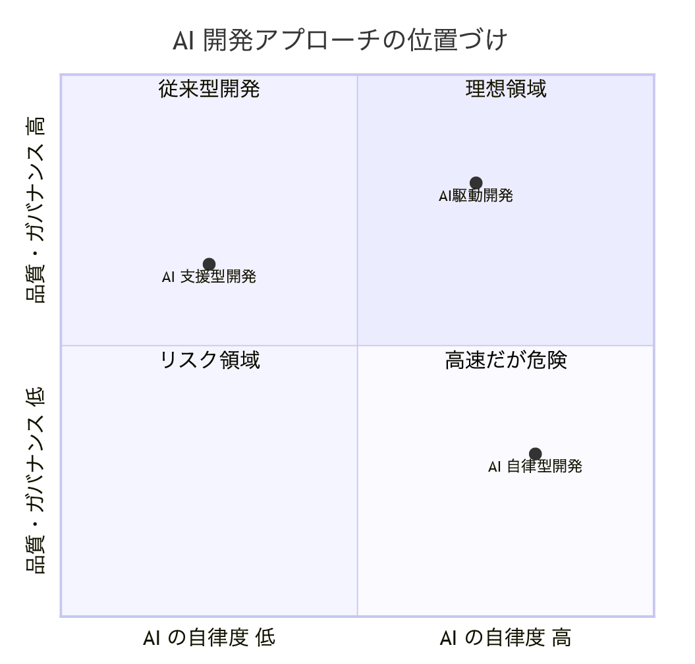
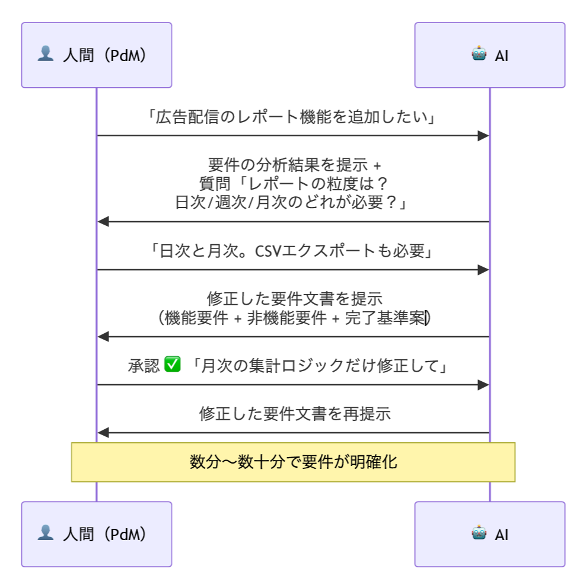
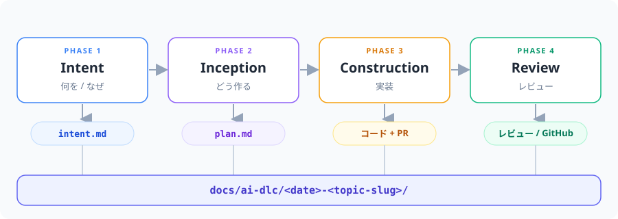
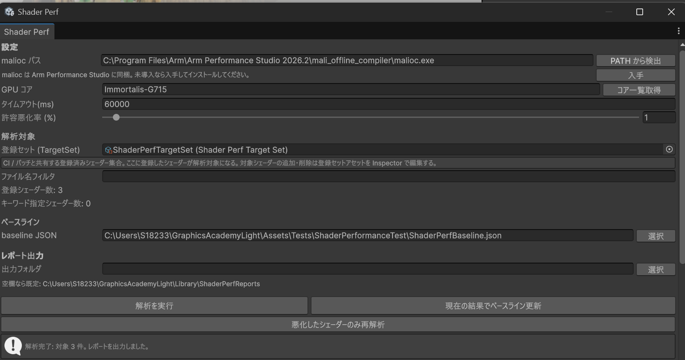
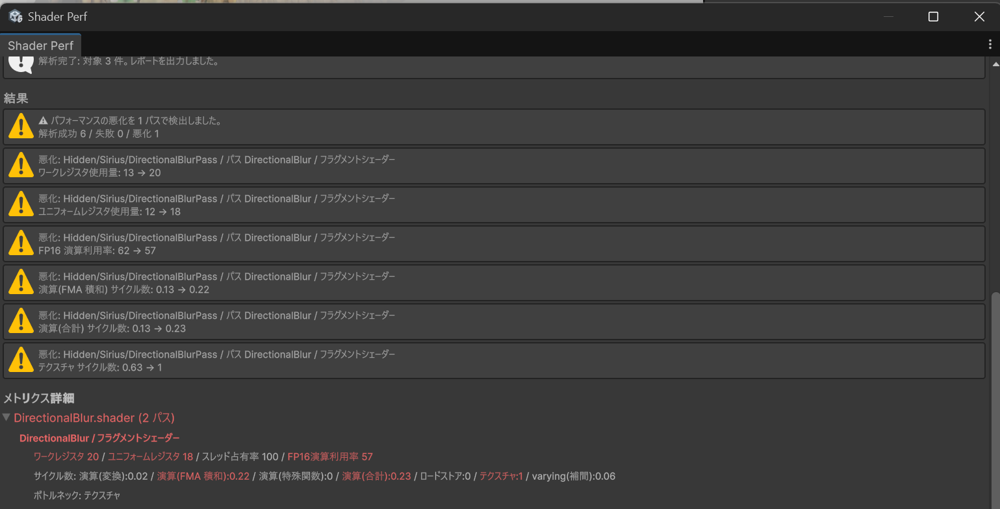
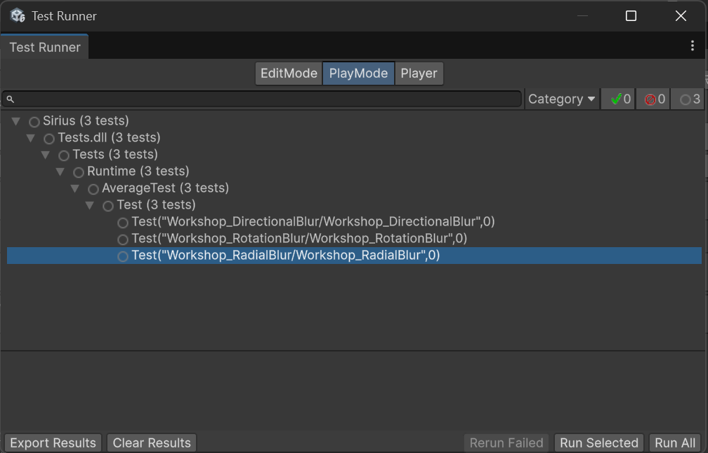
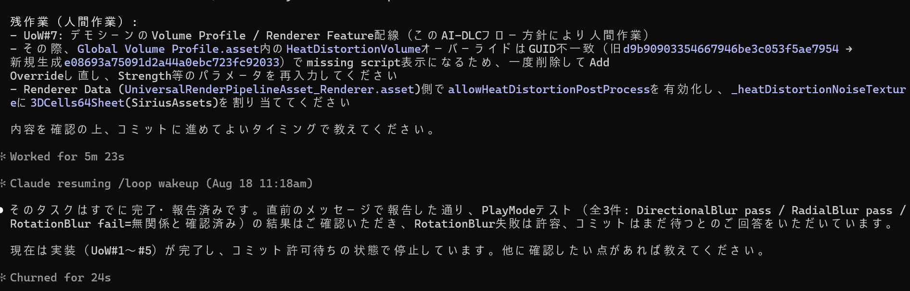
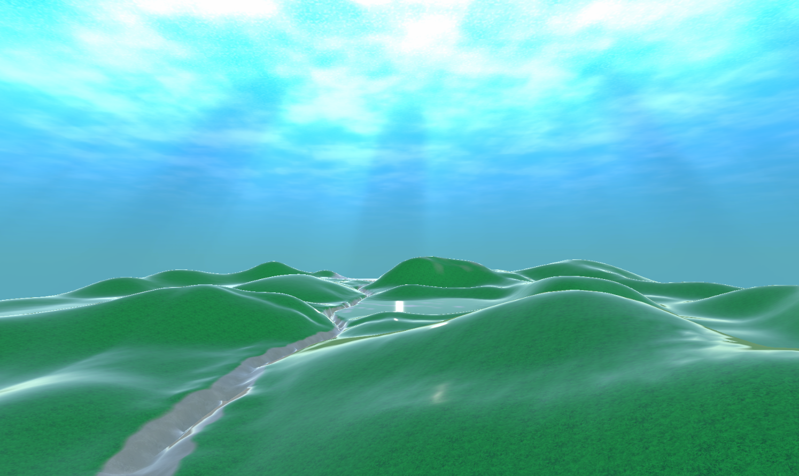

# Graphics Academy Light

こんにちは。サイバーエージェント ゲーム・エンターテイメント事業部、SGEコア技術本部（コアテク）のグラフィックスチームに所属している清原です。

このドキュメントでは、私たちグラフィックスチームが日々の開発で実際に取り入れている「AI駆動開発」という進め方をお伝えしていきます。

## 1 はじめに

サイバーエージェントでは、2028年までに、すべてのプロダクト開発チームが「要件を決めるところから本番リリースまで、AIと一緒に自動で進められる状態」になることを目指しています。ここでエンジニアに求められているのは、AIをただの便利な道具として使うことではありません。「AIエージェントと一緒に手を動かして、事業の成果を生み出すこと」です。実際に、今まで数日かかっていた作業が短時間で終わったり、AIで減らせた分の手間をほかの仕事に回せたりと、成果が少しずつ出はじめています。

### 1.1 サイバーエージェントで、こんなことが起きています

- 数日かかっていた作業が、数分で終わるチームがあります。
- テンプレートを整えただけで、AIの出す答えの品質がぐっと安定したチームがあります。
- 今までのスクラム（開発の進め方）を壊さずに、AIとの協力をうまく組み込んだチームがあります。

### 1.2 「個人でAIを使う」から「チームでAIを使う」へ

Cursor や Claude Code といったAIコーディングツールを、みなさんも普段から使っているのではないでしょうか。個人の生産性は、確かに上がっています。でも、こんな場面に心当たりはありませんか？

- 自分が見つけたAIの使い方やプロンプトのコツが、チームのみんなに広がっていない
- 同じチームなのに、人によってAIの使いこなし具合がバラバラ
- AIが書いたコードの「良い・悪いの基準」が人によって違う。「誰がレビューするか」で品質が変わってしまう
- AIのおかげで速く作れるようになったのに、レビューや承認が追いつかない

これは「個人でAIを使うこと」と「チーム・組織でAIを使うこと」の間にある、すき間（ギャップ）です。AIツールの使い方は、一人でも学べます。でも「チームとして、どうAIと協力するか」というやり方は、まだほとんどのチームが持っていません。

### 1.3 だから、共通の言葉が必要です

昔、私たちがアジャイルやスクラムを学んだとき、「スプリント」「バックログ」「レトロスペクティブ」といった共通の言葉を手に入れました。共通の言葉があると、チームどうしでノウハウを共有したり、新しく入った人をすぐに戦力にしたり、組織全体の開発のやり方を底上げしたりできます。

AI駆動開発は、いわば「AI時代の開発の共通言語」です。
今日お話しするのは、明日からすべてを変えるルールではありません。「AIとどう協力して進めるか」を考えるための、ものの見方です。これを知っておくだけで、チームでAIを使うときの話し合いがスムーズになり、ほかのチームの良い事例を自分のプロジェクトに取り入れやすくなります。

### 1.4 学校と会社の、AI活用の差

このように、サイバーエージェントでは「個人でAIを使う」のはもう当たり前になり、いまは「チームでAIを使うやり方」を固めていく段階に進んでいます。採用で求められるスキルも、個人の活用から一歩進んで、「チームで品質を守るための仕組みづくり」が評価されるようになってきました。

一方で、学校など教育の場でのAI活用には、「お金」という大きな壁があります。
一人でお金を払ってAIを使うのは、まだハードルは低いほうです。でも、これがチーム全体でAIを使うとなると、話は変わってきます。
けれども、今日お話しするAI駆動開発は、一人からでも始められます。そして、たとえチーム全体でAIを使うのがむずかしくても、AIコーディングのために整えた仕組みは、AIを使っていないメンバーにもちゃんと役に立ちます。

## 2 AI駆動開発とは

AI駆動開発とは、AIを開発の中心に置く、新しいソフトウェア開発の進め方です（AWSが「AI-Driven Development Life Cycle（AI-DLC）」として提唱しているものです）。この章では、AI駆動開発の全体像をお話ししていきます。

### 2.1 なぜ今、AI駆動開発なのか

2025年、AIコーディングツールは一気に広まりました。Cursor、Claude Code、GitHub Copilot など、多くのエンジニアが毎日のようにAIを使っています。しかし、「個人でAIを使うこと」と「チーム・組織でAIを使うこと」の間には、大きなすき間があります。

|段階|どんな状態か|課題|
|---|---|---|
|個人でのAI活用|各自がCodexやClaude Codeを使う|知識が個人に閉じてしまい、品質もバラつく|
|チームでのAI活用|チームでプロンプトや設定を共有する|進め方そのものは昔のまま。一部だけの改善にとどまる|
|AI駆動開発|AIが開発の中心的なパートナーになる|← ここを目指します|

AI駆動開発は、「AIにコードを書いてもらうこと」ではありません。AIが開発全体の進行役になり、自分から分析して提案する。そして人間がそれを判断する。この関係を、一つのやり方としてまとめたものです。

### 2.2 AI駆動開発の考え方

「AIにコードを書いてもらう」のと「AIと一緒に開発する」のは、やっていることがかなり違います。AI駆動開発は後者の考え方で、AIを補助ツールではなく、開発の中心にいる協力者として扱います。

下の図は、AIを使った開発の3つのやり方を、「AIにどれだけ任せるか（自律度）」と「品質・ガバナンス（安全に管理できているか）」という2つの軸で並べたものです。AI駆動開発は、AI支援型の安全さと、AI自律型の速さを、高いレベルで両立させることを目指すやり方です。



|やり方|説明|特徴|
|---|---|---|
|AI支援型開発|人間が中心で開発を進め、AIはコード補完やレビューの手伝いとして使う|安全さ重視。AIに任せる度合いは低い|
|AI自律型開発|AIにほとんど任せて、人の関わりを最小限にする（Vibe Codingなど）|速いけれど、品質・安全さが下がるリスクがある|
|AI駆動開発|AIが計画・実装を提案し、人間が承認・チェックする協力スタイル|速さと安全さの両方を実現する、理想の位置を目指す|

### 2.3 いちばん大事な考え方（コアメンタルモデル）

AI駆動開発を理解するうえで、いちばん大事なのがこの「コアメンタルモデル」です。要件定義・設計・コーディング・テスト・運用といった開発のいろいろな作業が、この4ステップの高速サイクルにまとまります。

人間がやることは、最初の「やりたいこと」をAIに渡すことだけです（この「やりたいこと」を **Intent** と呼びます。Intent は「Description＝何を」「Context＝なぜ・どんな制約か」「Completion Criteria＝どうなったら完成か」の3つでできています）。そこから先は、AIが進行役になります。AIが計画を立て、分からない点を整理して質問し、いくつかの選択肢を出し、人間の承認をもらってから実装する。この流れを、AI自身が回していきます。


#### 具体例：要件を分析するとき



AI駆動開発では、「AIが自分から提案し、人間が判断する」という形が大切になります。

- AIは受け身で待つのではなく、自分から提案する
  - 人間はすべてを指示するのではなく、AIの提案に対して「これでいい／ここは違う」と判断する
    - このやり取りを、要件でも設計でも実装でも、同じように繰り返す

### 2.4 4つのフェーズ ― 背景が途切れにくい開発

昔ながらの開発では、要件→設計→実装→レビューと進むたびに、「なぜこう決めたのか」という背景（コンテキスト）が、だんだん失われがちでした。

複雑な機能を作るとき、一つの会話（セッション）を長く続けすぎると、AIが覚えておく情報でいっぱいになり、だんだん性能が落ちていくことが知られています。こういうときは、会話の記憶を整理する（Clear や Compaction をする）のが良いとされています。ただ、何も考えずに記憶を消してしまうと、それまでの大事なやり取りまで一緒に消えてしまいます。すると、AIはまたコードをイチから調べ直して、背景を組み立て直すことになります。この調べ直しのためにトークン（AIの処理量の単位）が無駄に使われ、その分だけAI利用のコストもふくらんでいきます。

そこで、記憶を消したり整理したりする前に、それまでの情報をマークダウンの文書にまとめてから次の会話へ引き継ぐ。これが定番のやり方（ベストプラクティス）の一つです。

コアテクのグラフィックスチームで実践しているAI駆動開発では、4つのフェーズの間で、この背景情報をきちんと形にして次へ渡すようにしています。こうすることで、さきほどの「記憶が消えて、また調べ直し」という問題を軽くできます。

|フェーズ|主にやること|
|---|---|
|Phase 1 Intent 起票（何を／なぜ）|intent.md を作る|
|Phase 2 Inception（どう作る）|plan.md を作る|
|Phase 3 Construction（実装）|コーディング＋PR|
|Phase 4 Review|チャットでのレビュー依頼／GitHub上でのAIどうしのクロスレビュー|



AI駆動開発では、それぞれのフェーズの中に、さらに細かいステージがあります。ただし、すべてのフェーズ・ステージを必ず通るわけではありません。プロジェクトややりたいことに合わせて、AIが「今回はこの組み合わせでいきましょう」と提案してくれます。

フェーズからフェーズへの引き継ぎは、**すべてマークダウンの文書で行います**（その文書だけを読めば分かる、自己完結した形にします）。だから、フェーズが一つ終わるごとに `/clear`（会話の記憶をリセット）しても大丈夫です。

#### Phase 1 Intent 起票（何を／なぜ）

**決めること**
1. Description — 何を作るか（「どんな場面でも使える機能」として書きます。ここには作り方は書きません）
2. Context — なぜ作るか、どんな制約があるか。特に ★動的軸（静的／半動的／完全動的）は必ず書きます（これは Phase 2 で「使う側から見た形（インタフェース）」を決めるための材料になります）。ほかに、どのパッケージに置くか、既存の仕組みとの関係、パフォーマンスの制約（他と比べてどうか）、想定する使われ方、依頼の背景、この分野ならではの注意点などを書きます
3. Completion Criteria — 「どうなったら完成か」を、3つの形で書きます（✅うまくいった状態／❌失敗の状態／🔒品質のチェック項目）

**決めないこと**
スケジュール／あとの工程で決まる数値（今は仮置き）／CLAUDE.md にすでに書いてあるルール／具体的な検証手段の固有名 → これらは plan.md などに回します。

**作るもの**
- `docs/ai-dlc/<date>-<topic-slug>/intent.md` を1枚（このテンプレートをコピーして記入します）

#### Phase 2 Inception（どう作る）

**決めること**
1. 既存コードの制約（Step 1） — 設計の前に、まず調べて確定させておくこと
2. 採用する設計（Step 2〜3） — まず2〜3案を出して、その中から1案を選びます
3. 使う側から見た形＝インタフェース層（Step 3） — Intent の動的軸と、いまの公開の作りに合わせて決めます
4. UoW（作業のかたまり）への分解（Step 4） — 対象ファイル／依存関係／並行して進められるか／担当（AI・人間・両方）を決めます。目安は「1つのUoW ≒ コミット1〜2個」くらいの大きさです
5. どこにコミットするか（Step 5） — SIRIUS / SiriusPackages / SiriusAssets のどこに入れるか（これでPRの本数が決まります）

**決めない／残しておくこと**
- ボツにした案と、その理由を消さない（「なぜこの設計にしたか」の記録になります）。理由は、だれが読んでも分かる形で書きます（❌「複雑だから」→✅「カスタムEditorを作り直す必要があり、作業のかたまりが2倍になるから」）
- 人間がやるUoWは、はっきり書いておく（ShaderGraphの編集や、Timeline・FBXの配置はAIに任せません）
- Intent の完成条件が足りなくて詰まったら、Phase 1 に戻ります（Phase 2 であとから付け足さない）

**作るもの**
- `docs/ai-dlc/<date>-<topic-slug>/plan.md` を1枚（plan-template をコピーします）
  - 書く項目：採用した設計（公開の作り／インタフェースを含む）／ボツ案とその理由／UoW一覧（対象・依存・担当・コミット先）／並行して進められるペア／触ってはいけないファイル

#### Phase 3 Construction（実装）

**やること**
- 実装（Step 2） — 対象パッケージの `CLAUDE.md` / `SKILL.md` を読み、対象ファイルを Read してから Edit / Write します。この構成では並行実装はせず、すべてのUoWを順番に進めます
- コンパイル（Step 3） — エラーが消えるまで、次に進みません
- テスト＝品質チェック（Step 4・必須）
  - macOS（iOS向け）と Windows（Android向け）の**両方**で、すべての AverageTest（見た目のチェック＋EditModeのテスト全部）が成功していることが必須です
    - シェーダーや描画の変更は、直したところ以外の画面にも影響することがあるため、変更箇所に関係なく必ず全部テストします
    - たまに失敗する（flaky な）テストの扱い：最初の1回＋やり直し2回＝最大3回まで試し、失敗したテストだけをやり直します。1回でも成功すればOKとします
    - コマンドが時間切れ（180秒）になっても、それはテストの失敗ではありません → バックグラウンドで実行し、`TestResults/<ts>.xml` を見て合否を判断します

**やらないこと／守ること**
- コミットから先（commit / push / PR）のgit操作は、**ユーザーがはっきり許可したときだけ**行います。許可がなければ、Step 4（実装＋テスト通過）まで終えたところで報告して止まります
- コミットメッセージは日本語で書く／サブモジュールのポインタはコミットしない／`git add` はファイル名をはっきり指定する／`.meta` にはAIが編集したものを混ぜない（CLAUDE.md のルール）
- plan.md と実装が食い違ったら、plan.md のほうを更新します（設計と実装のズレを残さないため）

**作るもの**
- PR
  - `SiriusPackages/` の中身が変わったときは、`CLAUDE.md` / `SKILL.md` を別のコミットで更新します（ドキュメントの自動更新）

#### Phase 4 Review

**決めること**
1. 対象のPR — 引数でPR番号／URLを渡すか、なければ今のブランチから自動で見つけます。関連するPRがあるかを確認して、まとめて扱います
2. レビュアーを選ぶ — PRの作者（自分）を除いたチームメンバーから、複数選びます（AskUserQuestion／複数選択）。表示は「表示名」を使います
3. 変更の概要 — PRのタイトル・本文・変更ファイルから、**1〜2個の箇条書き（各1〜2行）**にまとめます。細かい内容はPR本文にゆずります
4. 送っていいか — プレビューを見せて、「送る／直す／やめる」を確認します

**やること**
- PR情報の取得（`gh pr view --json ...`）→ リポジトリ名・作者を読み取る
- メッセージをフォーマットに沿って作り、プレビューする
- GitHub側でレビュアーを設定（`gh pr edit <PR> --add-reviewer ...`。関連PRにも同じレビュアーを設定）
- チームで使っている連絡手段へ投稿する（送り方はチームごとに違うので、ここでは手順を固定していません）
- Codexによる自動レビューと、Claudeによる自動対応
  - Claudeが自動で対応したあと、最後は人間が確認・承認します

## 3 AI駆動開発を支える「ハーネスエンジニアリング」

### 3.1 ハーネスエンジニアリングとは

**ハーネス（harness）** とは、AIエージェントのまわりに組む「足場」のことです。もともとは馬具や、安全帯（登山や高い所での作業で、落ちないように体を支えるベルト）を指す言葉で、ソフトウェアの世界では、テストを自動で動かす仕組み（テストハーネス）として使われてきました。AI駆動開発では、これを **「AIに自分で走ってもらいながら、落ちないように支える足場」** という意味に広げて使います。

なぜ足場が要るのでしょうか。あとの 1-2 / 1-3 節でも見るように、AIは「なんとなくそれっぽい」コードを確率的に書くので、**コンパイルは通るし、動いてもいるのに、こっそり間違っている**コードを作ってしまうことがあります。ここで足場を組まずに「AIにどんどん任せる」だけにすると、速いけれど品質が保証されない開発（Vibe Coding）に傾いてしまいます（→ 2.2 節）。ハーネスは、この「任せる度合い」を **「安全に任せられる度合い」へ変える**ための仕組みです。

良いハーネスは、AIに次の3つを与えます。

| 役割 | 与えるもの | 具体例 |
|---|---|---|
| **手** | 環境に働きかける手段 | ビルド・テスト実行・エディタ操作を、AIから叩けるCLI／スキル |
| **目** | 結果を確かめるフィードバック | テスト結果・スクリーンショット・静的解析・レビュー |
| **柵** | 越えてはいけない境界 | 触ってはいけないファイル、承認が要る操作、コーディングのルール |

さらに、フェーズをまたいでも背景が失われないように **背景を形にして次へ渡す**仕組み（→ 2.4 節）も、広い意味でのハーネスに含まれます。

大事なのは、**ハーネスは一度作って終わりではなく、少しずつ育てていく「エンジニアリングの対象」だ**ということです。プロンプトのコツを個人でかかえこむのではなく、足場としてリポジトリに組み込む。そうすることで、AIの出力品質がチームでくり返し再現できるようになり、「誰がレビューするか」に左右されない品質基準ができあがります（→ 1.2 節）。この足場を作って育てていく活動を、**ハーネスエンジニアリング** と呼びます。次の節では、SIRIUS で実際に整えているハーネスを見ていきましょう。

### 3.2 SIRIUS のハーネス

SIRIUS のハーネスは、**「AIに任せる範囲」と「人間が承認する境界」を、はっきり決めておく**ための仕組みの全体です。「プロセス」「Unity操作の自動化」「品質チェック」「レビュー連携」「ルール」という5つの層でできていて、これらがかみ合うことで、*AIが自分から開発を回しつつ、品質は人間が守る* という AI-DLC の理想を実現しています。

#### ① プロセスハーネス ― AI-DLC の進行役

開発を、要件から実装・レビューまで、4フェーズの高速サイクルにまとめます（[`/ct-ai-dlc`](.claude/skills/ct-ai-dlc/SKILL.md) スキルが入口です）。

| Phase | やること | 成果物 |
|---|---|---|
| 1 Intent | 何を／なぜ（Description・Context・Completion Criteria） | `intent.md` |
| 2 Inception | どう作る（設計を出して選ぶ、UoW分解、コミット先決定） | `plan.md` |
| 3 Construction | 実装＋コンパイル＋品質チェック＋PR | コード／PR |
| 4 Review | チャットでのレビュー依頼＋GitHub上でのAIどうしのクロスレビュー | ― |

- **フェーズ間の引き継ぎは、すべてマークダウンで行います**（`docs/ai-dlc/<date>-<topic-slug>/` にたまっていきます）。各フェーズがその文書だけで完結するので、終わるごとに `/clear` しても背景を組み立て直せて、トークンの無駄づかいを防げます（→ 2.4 節）。
- Intent / Plan / PR のテンプレートが用意してあり、AIの出す答えの品質を安定させます。

#### ② Unity操作ハーネス ― uloop

AIがUnity Editorを直接動かすためのCLIを、Claude Code のスキルとして整えたものです。あらかじめ起動して温まった状態（ウォーム）のEditorにつないで動きます。

| 種別 | 主なスキル | 用途 |
|---|---|---|
| コンパイル／テスト | `uloop-compile` / `uloop-run-tests` | エラー確認、EditMode / PlayMode のテスト実行 |
| 実行時の確認 | `uloop-control-play-mode` / `uloop-screenshot` / `uloop-simulate-keyboard` / `uloop-simulate-mouse-*` / `uloop-record・replay-input` | Play Mode の操作・画面キャプチャ・入力の再現 |
| 状態しらべ | `uloop-get-logs` / `uloop-get-hierarchy` / `uloop-find-game-objects` / `uloop-execute-dynamic-code` | ログ・階層・GameObjectの調査、Scene / Prefab / AssetDatabase の操作 |

#### ③ 品質ハーネス ― 3つの防衛線

AIのバグは **クラッシュしない**ので、一見すると気づけません。だから、見つけられる範囲がちがう3つの手段を使い分けて、品質を守ります（→ 1-3 節）。

| 防衛線 | 見つけられるもの | 中身 |
|---|---|---|
| コードレビュー（目で見る） | はっきりしたロジックのミス、精度の使い分け | 人間＋AIのクロスレビュー |
| ビジュアルリグレッションテスト | ピクセル単位の変化（合成の式のズレなど） | `AverageTest.cs`（PlayMode）＋EditMode |
| モバイルGPUの静的解析 | レジスタ数・サイクル数の増加 | Mali Offline Compiler |

**PRをマージする前の必須チェック**：macOS（iOS向け）と Windows（Android向け）の**両方**で、すべての AverageTest が成功していること。自動でチェックする仕組み（CI）がまだ無いので、AIが手動で全部実行します。しきい値ぎりぎりで結果が揺れる（flaky な）テストは「最初の1回＋やり直し2回＝最大3回まで試し、1回でも成功すればOK」とし、3回連続で失敗したものは、差分の画像を付けて人間の判断にゆだねます。

#### ④ レビュー・協働ハーネス

- レビュー依頼をスキル化しておく ― GitHubのレビュアー設定と、チームのチャットへの依頼投稿をひとつの手順にまとめます（チームごとに連絡手段が違うので、このリポジトリには含めていません）
- PRの作成や、`SiriusPackages/` の `CLAUDE.md` / `SKILL.md` ドキュメントの自動更新
- **Codexによる自動レビュー → Claudeによる自動対応 → 人間が確認・承認** という、AIどうしのクロスレビュー連携

#### ⑤ ルールハーネス（ガードレール）― CLAUDE.md

AIが自分で走るときに、「ここから先は踏んではいけない」という線をルールにしています。

- `.meta` はAIが生成・編集しない（GUIDの衝突を避けるため）／サブモジュールのポインタはコミットしない
- **レビューの指摘をそのまま受け入れず、必ず実際のソースやコマンドで確かめる**
- `git` 操作（commit / push / PR）は、ユーザーがはっきり許可したときだけ。許可がなければ、実装＋テスト通過まででいったん止まって報告する
- コミットメッセージは日本語で書き、`git add` はファイル名をはっきり指定する

---

## 4 AI 駆動グラフィックスプログラミング ワークショップ

ここからは、実際に手を動かすワークショップの説明です。

このリポジトリは、**AI駆動開発（AI-DLC）** を体験しながら、Unityのポストエフェクト（ブラー系のシェーダー）を題材にグラフィックスプログラミングを学ぶための、学生向け講義用ブランチです。

「AIにコードを書かせて、人間がレビュー・計測・テストで品質を守る」という新しい開発スタイルを、実際に自分の手を動かして体験していきます。

### 4.1 このワークショップのゴール

- AIが生成したコードは **「動く」けれど「正しい」とはかぎらない** ことを、実際に体感する
- **コードレビュー／ビジュアルリグレッションテスト／モバイルGPUの静的解析** という3つの防衛線を、使い分けられるようになる
- ブラー系のシェーダーを題材に、**デグレ（見た目の劣化）とパフォーマンスの悪化を、自分の目と計測で見つけて直す** 力を身につける

---

### 4.2 進め方（タイムテーブル）

| # | 内容 | 形式 |
|---|---|---|
| 1 | AI駆動開発とは何か | 座学 |
| 2 | **【ワーク①】Directional Blur の品質改善** | ハンズオン |
| 3 | **【ワーク②】Radial Blur の最適化** | ハンズオン |
| 4 | **【ワーク③】新機能の実装（RotationBlur）** | ハンズオン |
| 5 | **【ワーク④】陽炎（HeatDistortion）をゼロから実装** | ハンズオン（本物のAI-DLC） |
| 6 | **【ワーク⑤】光芒（GodRay）をゼロから実装** | ハンズオン（本物のAI-DLC） |

ワーク①〜③と、ワーク④〜⑤では、進め方が違います。ワーク①〜③は、疑似的なフロー（`/workshop-ai-dlc`）で、わざと仕込んだ不具合を見つけて直す練習です。ワーク④〜⑤は、私たちが日々の開発で使っている本物のフロー（`/ct-ai-dlc`）で、要件の起票から実装まで、エフェクトを1本まるごと新規に作ります。こちらには仕込みの罠はありません。AIが書いたコードが正しいかどうかを、あなた自身が3つの防衛線で確かめます。

ワーク①〜③は、次の流れで進みます。

```
① AIに実装／改修をお願いする（プロンプトを投げる）
        ↓
② AIが「正しそうに見える」コードを作る（ここに罠が仕込まれています）
        ↓
③ あなたがレビュー・実行・計測して、デグレやパフォーマンスの悪化を見つける
        ↓
④ 原因をつきとめて直し、答え合わせをする
```

> 各ワークの「答え」は [`docs/workshop/answers/`](docs/workshop/answers/) にあります。**まずは自分で探してから**、diff（差分）で確認してください。

---

### 4.3 【ワークー１】Directional Blur の品質改善


#### 4.3.1 エフェクトの概要

**Directional Blur（方向ブラー）** とは、指定した1方向にだけ画像を引きのばすようにブレンドするブラーのことです。スピード線やダッシュの表現などに使われます。

#### 4.3.2 品質改善「前」のコードの、かんたんな説明

いまの実装は、**サンプリングを3回だけ**行う、あらいブラーです。フラグメントシェーダーの真ん中の部分だけ抜き出すと、こうなっています。

[SiriusPackages\Sirius.PostProcessing\Runtime\Shaders\DirectionalBlur.shader]
```cpp
// Blur
half4 blur_color = src_color;          // ① 元画像を1枚ぶん、最初に入れておく
for (int n = 0; n < 3; n++)            // ② 追加で3回サンプリングして足し込む
{
    const half displacement = DIRECTIONAL_BLUR_SAMPLING_OFFSET(n);
    blur_color += SAMPLE_TEXTURE2D(_BlitTexture, sampler_LinearClamp,
        IN.texcoord + displacement * _DirectionalBlurNormalizedDirection * _DirectionalBlurWidth * mask * fixed_aspect);
}

blur_color *= rcp(1 + 3);              // ③ 「元画像1枚 + サンプル3回」= 合計4枚で割って平均を出す
```

**このワークでやること**は、この「3回」のサンプリングを増やして、もっとなめらかで高品質なブラーにすることです。

> 🔍 **レビューで注目してほしいポイント（ここが、あとで出てくるデグレ・パフォーマンス悪化のヒントになります）**
> - `③` の正規化 `rcp(1 + 3)` の **`3` は、`②` のループ回数と同じ数** です。足した枚数で割らないと、平均になりません。**ループ回数を増やしたとき、この割る数も一緒に変わっていますか？**
> - サンプリング回数を増やすほど、`SAMPLE_TEXTURE2D`（テクスチャの読み込み）も増えます。**品質が上がるかわりに、GPUの負荷も上がります。** 増やした回数は、そのコストに見合っていますか？

#### 4.3.3 プロンプト（このワークを始める）

Claude Code に、次のプロンプトを投げて、AIに高品質化をお願いしてください。

```
/workshop-ai-dlc directional-blurを高品質化
```

AIがサンプリング数を増やした改修コードを作ります。作ったあと、**Unityで実際にブラーをオンにして見た目を確認 → 気になる点を計測・テストで裏づけ** してください。

<details>
<summary>確認のヒント（詰まったら開く）</summary>

- Strength=1.0, Width=0.5 で、ブラーの部分が **極端に明るくなっていないか** を目で確認する
- 明るくなっている場合は、生成コードの正規化（`rcp(...)` の割る数）とループ回数が合っているか確認する

</details>

#### 4.3.5 シェーダーの静的な性能テスト
今回のワークでは、テクスチャサンプル数を増やして、シェーダーの品質を上げているため、シェーダーの性能は当然悪化しています。
ただし、その悪化が想定範囲かどうかを確認することは重要です。想定外の悪化によって、レジスタスピルの発生、並列実行性の大幅な低下、ロードストアの大幅な増加などといった問題が起きる可能性があります。

そこで、今回はArm社が提供しているMali Offline Compilerを使って、シェーダーの静的な性能テストを行ってみます。

Unityのメニューバーから`Toos->Sirius->Dev Support->Shader Performance Analyzer`を実行して次の図のツールを起動してください。



開くことができたら、`解析を実行`ボタンを押して、性能テストを実施してください。
今回は悪化が検出されるので、次の図のような結果になります。



(※)Mali Offline Compilerがインストールできていない場合は、入手ボタンからMali OCをダウンロードしてください。

---

### 4.4 【ワークー２】Radial Blur の最適化


#### 4.4.1 エフェクトの概要

**Radial Blur（放射状ブラー）** とは、見ている中心（画面の真ん中など）を基点に、放射状に画像を流すブラーのことです。集中線・爆発・加速感の演出に使われます。

#### 4.4.2 最適化「前」のコードの、かんたんな説明

いまの実装は、**すべての変数が `float`（32bit）** で書かれています。どんな場面でも安全ではありますが、モバイルGPUでは `half`（16bit）にしたほうが、レジスタ・メモリ帯域・電池のもちをおさえられます。**このワークでやることは、この `float` を `half` に置きかえる、モバイル向けの最適化** です。

真ん中の部分を抜き出すと、こうなっています（注目してほしい2行にコメントを付けています）。

[SiriusPackages\Sirius.PostProcessing\Runtime\Shaders\RadialBlur.shader]
```cpp
// モバイル最適化前: すべての変数が float（ワークショップ演習の出発点）
uniform float _RadialBlurGazePositionX;
uniform float _RadialBlurGazePositionY;
uniform float _RadialBlurStrength;
// ...（中略）...

float4 frag (const Varyings IN) : SV_Target
{
    // ...（距離・方向の計算、6 回サンプリングして平均化）...

    // Composite
    const float blur_strength = max(1e-5, _RadialBlurStrength);
    const float t = SafePositivePow_float(normalized_distance, 0.5h) * blur_strength;  // ★A: pow(x, 0.5)=sqrt でフォールオフを描く
    return lerp(src_color, blur_color, saturate(t));                                    // ★B: saturate() で t を [0,1] に収める
}
```

> 🔍 **レビューで注目してほしいポイント（ここが、あとで出てくるデグレ・パフォーマンス悪化のヒントになります）**
> - 最適化とは「**見た目を変えずに軽くする**」ことです。`float → half` は基本これに当てはまりますが、「**ついでにここも軽くできそう**」と削ってはいけない場所があります。
> - **★A の `SafePositivePow(x, 0.5)`（＝平方根）** は、中心から端に向かうブラーの効き方（フォールオフカーブ）を決めています。「`pow` は重いから、直線で近似しよう」とすると、**カーブが変わって見た目も変わります**（＝これは最適化ではなくデグレです）。`sqrt(0.5) ≈ 0.707` と `0.5` は、どれくらい違うでしょうか？
> - **★B の `saturate(t)`** は、`Strength` が 1.0 をこえたときに `t` が 1.0 をこえて、`lerp` が **外挿（範囲の外まで計算してしまうこと）** するのを防いでいます。「`Strength` は Volume 側で制限されている *はず* だから要らない」と思い込んで消すと、画面の端でハイライトが白飛びしたり、暗い部分が反転したりします。

#### 4.4.3 プロンプト（このワークを始める）

```
/workshop-ai-dlc radial-blurを最適化
```

AIが `half` 化した最適化コードを作ります。作ったあと、**見た目が「前」と変わっていないか** をきびしくチェックし、**Mali Offline Compiler で本当に軽くなったか** を計測してください。

<details>
<summary>確認のヒント（詰まったら開く）</summary>

- **Strength=1.5, Width=0.5**（Strength を 1.0 より大きくするのがポイント）で、画面の端のハイライトが白くなりすぎたり、暗い部分が反転していないかを目で見る
- ビジュアルリグレッションテストを実行して、中心→端のフォールオフが正解と変わっていないか確認する
  ```
  /uloop-run-tests --test-mode PlayMode --filter-type regex --filter-value ".*RadialBlur.*"
  ```
- Mali Offline Compiler で、`float` 版 / `half` 版の fp16_arithmetic の比率と Work Registers Used を比べる
- 答え合わせ: [`docs/workshop/answers/RadialBlur.shader`](docs/workshop/answers/RadialBlur.shader)

</details>

#### 4.4.4 ビジュアルリグレッションテストを実施する
では、実施した最適化でデグレが起きていないか確認をしてください。
ビジュアルリグレッションテストは、Unityのメニューバーから`Toos->General->Test Runner`を選択して次のウィンドウを開いてください。



ウィンドウを開けたら、PlayModeを選択後、`Workshop_RadialBlur`を選択して`Run Selected`を押してください。
すると、リグレッションテストに失敗して、デグレが起きていることが分かります。
この不具合の原因を調査して修正してください。


#### 4.4.5 パフォーマンステストを実施する
最後にパフォーマンステストを実施します。性能が良化したかどうかはきちんと計測する必要があります。
`Toos->Sirius->Dev Support->Shader Performance Analyzer`から性能テストを実施してください。

---

### 4.5 【ワークー３】新機能の実装（RotationBlur）


このワークでは、まだ存在しない **RotationBlur（回転ブラー）** を、AIと一緒にゼロから実装します。対象のシェーダーは、次のように「赤一色を返すだけの中身が空のもの（スタブ）」になっていて、ここに中身を作っていきます。

[SiriusPackages\Sirius.PostProcessing\Runtime\Shaders\RotationBlur.shader]
```cpp
half4 frag(const Varyings IN) : SV_Target
{
    // ワークショップ演習 Part 2: RotationBlur
    // /workshop-ai-dlc rotation-blurを実装 を実行してここを実装してください
    return half4(1.0h, 0.0h, 0.0h, 1.0h);
}
```

#### 4.5.1 これから作る RotationBlur の仕様

**RotationBlur（回転ブラー）** とは、指定した中心点を軸にして、各ピクセルを **接線方向（円の接線＝回転していく方向）** へブレンドするブラーのことです。カメラや被写体が回転しているような、うずまき・スピン感の演出に使います。

Sirius のポストエフェクトは、**Volume（パラメータ）／ RenderPass（描画の制御）／ Shader（画像処理）** の3つの層で作ります。RotationBlur も、同じ作りで実装します。

パラメータ（Volume）は、次のとおりです。

| パラメータ | 意味 |
|---|---|
| Center X / Y | 回転の中心点（UV座標 0〜1） |
| Strength | ブラーの強さ（距離をもとにしたブレンドの係数） |
| Width | ブラーの幅（接線方向のサンプリング距離のスケール） |
| Mask | 効果をかける範囲（Rチャンネル） |

シェーダーがやるべき処理は、大まかに次の流れです。

```
① 中心点から各ピクセルへ向かうベクトル d と、その距離 dist を求める
② d に垂直な「接線方向」のベクトルを作る  a
③ 接線方向にそって、複数回サンプリングして平均を出す
④ 中心からの距離に応じてブレンドする
```

> 🔍 **仕様のポイント（ここが、あとで出てくるデグレ・パフォーマンス悪化のヒントになります）**
>
> 1. **変位は「中心からの距離」に比例させます。**
>    回転では、同じ角速度でも **中心から遠いピクセルほど、えがく弧が長く（＝大きく）動きます**。自転車のホイールを思いうかべてください。外側のスポークほど速く動きますね。だから、接線方向のサンプリング量は、距離 `dist` に合わせてスケールする必要があります。
>    **中心の近くと画面の端で、ブラーの強さが「同じ」に見えたら、距離によるスケールが抜けています。**
>
> 2. **接線方向には、アスペクト比の補正が必要です。**
>    UV空間（0〜1）は縦横で同じスケールですが、実際のピクセルでは、横長の画面ほど横方向がのびます。補正しないと、**本来は正円であるはずの回転ブラーが、横長画面で楕円にゆがみます。**
>
> 3. **モバイル向けに `half` 精度で書きます。**
>    UVの 0〜1 の範囲での計算なので、`half` で十分です。`float` のままだと、レジスタ・帯域・電池のもちで不利になります（ワーク②と同じ考え方です）。
>
> 4. **ブレンドの係数は `saturate` でクランプします。**
>    強さが大きいときに `lerp` が外挿しないよう、ブレンドの係数を `[0,1]` の中におさめます（ワーク②の ★B と同じ考え方です）。

#### 4.5.2 プロンプト（このワークを始める）

```
/workshop-ai-dlc rotation-blurを実装
```

AIが Volume / RenderPass / Shader を作ります。途中で、**中心点のあつかいや、精度、アスペクト比の補正** について、あなたの判断を求められます。

また、今回のワークでは、`Volume`と`Renderer Feature`の設定が必要なのですが、この設定も、次のプロンプトを入力して、Claudeにさせてみましょう。

```
Workshop_RotationBlurシーンでRotationBlurを確認できるように、Volume、Renderer Featureの設定を行ってください。
```

UnityでRotationBlurを確認できるようになったら、上の「仕様のポイント」に照らして、**見た目** が仕様どおりか検証してください。

<details>
<summary>確認のヒント（詰まったら開く）</summary>

- 画面の中心の近くと、画面の端（中心から遠い位置）で、**ブラーの強さが変わっているか**（同じに見えたら、距離スケールを疑う）
- 横長の画面（1920×1080）で、ブラーの形が **正円になっているか**（楕円なら、アスペクト比の補正を疑う）
</details>

#### 4.5.3 ビジュアルリグレッションテストを実施する

今回の実装は新規実装なので、本来は正解となる画像データがないため、ビジュアルリグレッションテストを実施することはできないのですが、今回は正しい修正ができているかどうかの確認のために、正解画像を用意しています。

対応ができた人は`Toos->General->Test Runner`からRotationBlurのテストを実行してください。


---

### 4.6 【ワーク④】陽炎（HeatDistortion）をゼロから実装

ここからの2つのワークは、疑似体験となるAI-DLCではなく、コアテクのグラフィックスチームで実際に使われているAI-DLCのスキル（`/ct-ai-dlc`）で、Intent（何を・なぜ）→ Inception（どう作る）→ Construction（実装）と進め、エフェクトを1本まるごと新規に作ります。
実装後はPRの作成 -> Codexによる自動レビュー -> Claude Codeによるレビュー対応の検討といったAIによるクロスレビューまで体験してもらいます。

#### 4.6.1 エフェクトの概要

**陽炎（HeatDistortion）** は、熱せられた空気ごしに、遠くの景色がゆらいで見える現象です。夏のアスファルトや、たき火の向こう側を思い浮かべてください。ゲームでは、爆発・炎・砂漠・エンジンの排気といった熱の表現に使います。

#### 4.6.2 ブラーとの違い

作りはこれまでと同じ3層（Volume ／ RenderPass ／ Shader）ですが、今回は3Dテクスチャと深度値を利用して、ゆがみを発生させます。
このような技術的仕様はこれまでのシンプルなプロンプト`/ct-ai-dlc 陽炎（HeatDistortion）を実装`のような指示では決定することが難しいため、プロンプトで明確に指示を出すか、実装の計画自体をAI-DLCを利用して壁打ちして作っていく必要があります。
今回はプロンプトで具体的な指示を出していきます。


#### 4.6.3 プロンプト（このワークを始める）

```
/ct-ai-dlc 陽炎（HeatDistortion）をfeat/ユーザー名/heatDistortionブランチに実装。歪みは3Dのノイズテクスチャと深度情報を元に実装します。ノイズテクスチャはプリセットとして3DCells64Sheetが用意されているので、これを利用してください。
```

AIがIntentの起票から付き合います。Description・Context・Completion Criteria を一緒に埋め、Inception で精度やマスクの設計を相談し、承認してから Construction で実装します。フェーズごとに `/clear` を挟んでも、`docs/ai-dlc/` に残るMarkdownから続きを再開できます。

####  4.6.4 Phase 3の実装完了後
Phase 3の実装が完了すると次のように、動作を確認するための人間の残作業がAIから提示されます。
これらの指示について、不明な点があればAIに質問してすすめるのもよいですし、前節のように、シーンのセットアップなどを全てAIに行わせるのもOKです。
AIから提示された確認事項を進めて、コミット->PR作成まで進めてください。



#### 
---

### 4.7 【ワーク⑤】光芒（GodRay）をゼロから実装


最後のワークは、複数のパスをつないで作る、いちばん難しいエフェクトです。

#### エフェクトの概要

**光芒（GodRay、薄明光線）** は、雲の切れ間や木々のすき間から、光が筋になって差し込んで見える現象です。逆光のシーンに、強い印象を与えます。

#### ワーク②の放射状ブラーを、また使う

光芒の心臓部は、光源に向かってかける放射状ブラーです。ワーク②で最適化した RadialBlur の考え方を、そのまま部品として使えます。ただし1回のブラーで終わりではなく、いくつかのパスをつないで作ります。

1. 明るいところだけを抜き出す（二値化）
2. 光源の位置へ向かって、放射状にブラーをかける（ガウス重み付き。さらに前フレームの結果も混ぜて、少ないサンプルでも滑らかにする＝テンポラル）
3. 元の画面に合成する（乗算・加算・スクリーンから選ぶ）

#### 難しさの肝

> 1. **光源をどこに向かってブラーするか**
>    主光源の向きを、画面上のどの点に投影するかを計算します（ワールド座標からスクリーン座標への投影）。この計算は `GodRayHelper` に用意してあります。
> 2. **パスをつなぐ**
>    RenderGraph で、二値化 → 放射状ブラー → 合成を順につなぎます。中間結果のテクスチャをどう受け渡すかが要点です。
> 3. **テンポラル**
>    前フレームの結果を、前フレームのVP行列で今フレームに再投影して混ぜます。残像（ゴースト）が出ないよう、混ぜ具合を調整します。この土台となる履歴バッファは `GodRayBlurHistory` に用意してあります。

#### 仕様のポイント（レビューで注目してほしいところ）

> - **ブレンドモード**：乗算・加算・スクリーンで、見た目が大きく変わります。加算は明るく飛びやすく、乗算は落ち着きます。狙いに合っているか確認します。
> - **サンプル数とコスト**：サンプルを増やすほど滑らかになりますが、そのぶん重くなります。テンポラルでどこまで補えるかを考えます。
> - **テンポラルの残像**：カメラが速く動いたとき、光の筋が尾を引いていないか確認します。

#### プロンプト（このワークを始める）

```
/ct-ai-dlc 光芒（GodRay）を実装
```

> あらかじめ用意してあるもの：光源をスクリーンに投影する `GodRayHelper`、テンポラルの履歴バッファ `GodRayBlurHistory`、明るい光源と遮蔽物のあるデモシーン、赤を返すだけの空シェーダー2枚。あなたが作るのは Volume・RenderPass（マルチパスの制御）・シェーダーの本体です。

<details>
<summary>確認のヒント（詰まったら開く）</summary>

- 光源の位置と、光の筋が集まる中心が合っているか
- ブレンドモードを切り替えて、狙いの見た目になるものを選ぶ
- テンポラルは数フレーム回すと安定します。カメラを止めた状態で残像が消えるか
- Mali Offline Compiler で、サンプル数ごとのコストを見る
- 答え合わせ: [`docs/workshop/answers/GodRay/`](docs/workshop/answers/GodRay/)

</details>

---

#### 付録：ワークのあとで元に戻す

各ワークで変更したシェーダーは、次のワークに進む前に元へ戻せます。

```bash
# ワーク① Directional Blur を元に戻す
git checkout HEAD -- SiriusPackages/Sirius.PostProcessing/Runtime/Shaders/DirectionalBlur.shader

# ワーク② Radial Blur を元の float 版に戻す
git checkout HEAD -- SiriusPackages/Sirius.PostProcessing/Runtime/Shaders/RadialBlur.shader

# ワーク③ RotationBlur を赤スタブに戻す（生成した C# の削除は skill の Phase 6 の手順を参照）
git checkout HEAD -- SiriusPackages/Sirius.PostProcessing/Runtime/Shaders/RotationBlur.shader

# ワーク④ 陽炎（HeatDistortion）を赤スタブに戻し、生成した C# を削除する
git checkout HEAD -- SiriusPackages/Sirius.PostProcessing/Runtime/Shaders/HeatDistortion.shader
git rm SiriusPackages/Sirius.PostProcessing/Runtime/Scripts/Volumes/HeatDistortionVolume.cs
git rm SiriusPackages/Sirius.PostProcessing/Runtime/Scripts/Features/Passes/HeatDistortionPass.cs
git checkout HEAD -- SiriusPackages/Sirius.PostProcessing/Runtime/Scripts/Features/SiriusPostProcessingFeature.cs

# ワーク⑤ 光芒（GodRay）を赤スタブに戻し、生成した C# を削除する（GodRayHelper / GodRayBlurHistory は用意済みのため残す）
git checkout HEAD -- SiriusPackages/Sirius.PostProcessing/Runtime/Shaders/GodRay/Binarization.shader SiriusPackages/Sirius.PostProcessing/Runtime/Shaders/GodRay/GodRayRadialBlur.shader
git rm SiriusPackages/Sirius.PostProcessing/Runtime/Scripts/Volumes/GodRayVolume.cs SiriusPackages/Sirius.PostProcessing/Runtime/Scripts/Features/Passes/GodRayRenderPass.cs
git checkout HEAD -- SiriusPackages/Sirius.PostProcessing/Runtime/Scripts/Features/SiriusPostProcessingFeature.cs
```

---

#### 参考リンク

- 座学のくわしい版： [`docs/workshop/01_intro_ai_dlc.md`](docs/workshop/01_intro_ai_dlc.md)
- 各ワークの答え： [`docs/workshop/answers/`](docs/workshop/answers/)
- ワークショップ進行スキル： [`.claude/skills/workshop-ai-dlc/SKILL.md`](.claude/skills/workshop-ai-dlc/SKILL.md)

このドキュメントが、みなさんがAIと一緒に開発していくときの一助になれば幸いです。
