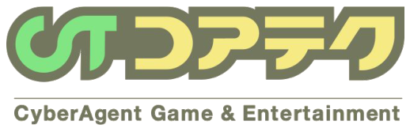
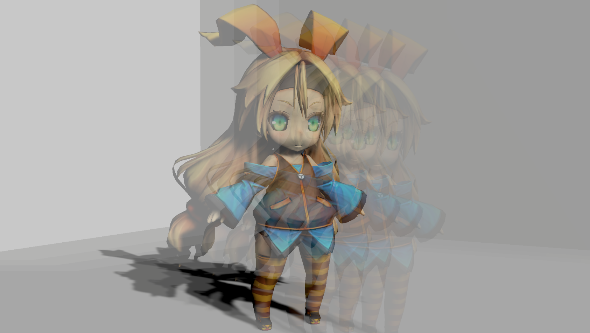
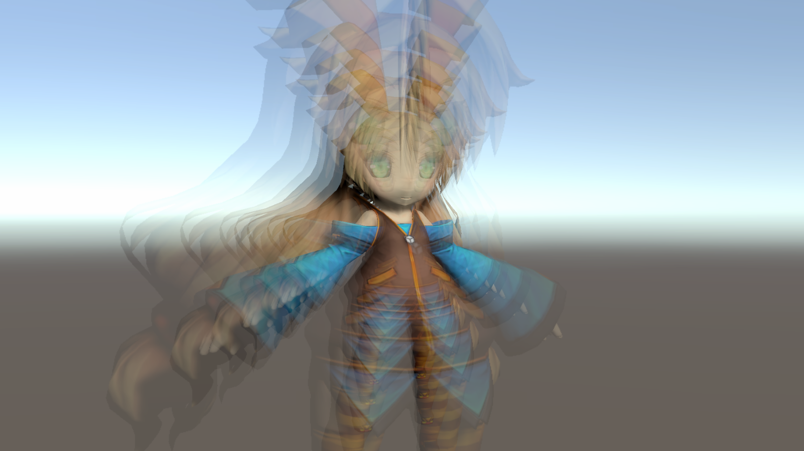
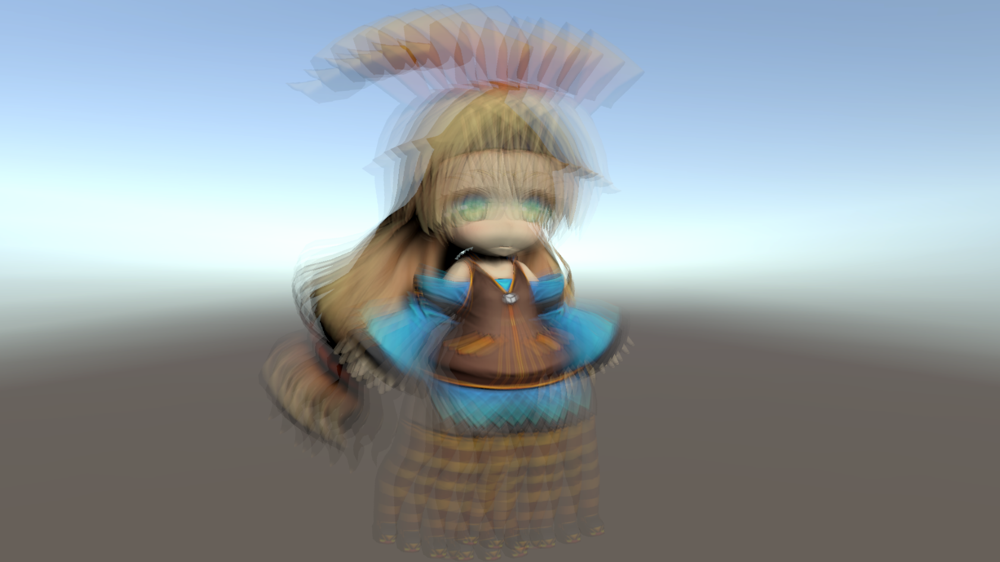
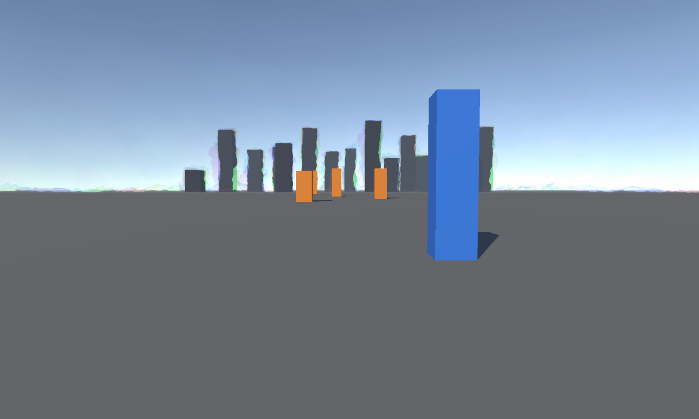

<style>
@import url('https://fonts.googleapis.com/css2?family=M+PLUS+1p:wght@400;500;700&display=swap');

:root {
  --c-text: #74775e;
  --c-green: #a3e685;
  --c-pink: #fdc4c4;
  --c-teal: #0097a7;
  --c-yellow: #f3eb83;
  --c-bg: #fffcf0;
}

section {
  background: var(--c-bg);
  color: var(--c-text);
  font-family: 'M PLUS 1p', 'Hiragino Kaku Gothic ProN', 'Yu Gothic', sans-serif;
  font-weight: 400;
  line-height: 1.5;
  position: relative;
}

h1, h2, h3, h4 {
  color: var(--c-text);
  font-weight: 500;
  line-height: 1.3;
}

a { color: var(--c-teal); }
strong { font-weight: 700; }

table { font-size: 0.85em; }
th {
  background: var(--c-yellow);
  color: var(--c-text);
}

section footer {
  font-size: 0.45em;
  color: var(--c-text);
  opacity: 0.65;
  left: auto;
  right: 40px;
  bottom: 18px;
}

/* ページ番号は左下へ逃がし、右下の著作権表記と衝突させない */
section::after {
  left: 24px !important;
  right: auto !important;
  bottom: 14px !important;
  font-size: 0.55em;
}

/* 共通パーツ：ロゴ（コンテンツスライドは右上、チャプター区切りは左上） */
section:not(.cover)::before {
  content: "";
  position: absolute;
  top: 26px;
  width: 120px;
  aspect-ratio: 418 / 92;
  background: url('figs/logo/coretec-logo.png') no-repeat center / contain;
}
section:not(.cover):not(.chapter)::before { right: 40px; }
section.chapter::before { left: 40px; }

/* 通常コンテンツスライドの見出し：高さを固定し、1行でも2行でも下線バーの位置と本文の開始位置を揃える */
section:not(.cover):not(.chapter) h2,
section:not(.cover):not(.chapter) h3,
section:not(.cover):not(.chapter) h4 {
  position: relative;
  font-size: 1.4em;
  line-height: 1.3;
  min-height: 2.6em;
  margin: 0 0 0.6em 0;
  padding: 0 0 16px 0;
}
section:not(.cover):not(.chapter) h2::after,
section:not(.cover):not(.chapter) h3::after,
section:not(.cover):not(.chapter) h4::after {
  content: "";
  position: absolute;
  left: 0;
  right: 0;
  bottom: 0;
  height: 6px;
  background: var(--c-yellow);
}

/* チャプター区切りスライド */
section.chapter {
  display: flex;
  flex-direction: column;
  justify-content: center;
}
section.chapter .eyebrow {
  font-size: 1em;
  margin: 0 0 0.5em 0;
}
section.chapter .chapter-bar {
  height: 8px;
  width: 60%;
  background: var(--c-yellow);
  margin-bottom: 0.7em;
}
section.chapter h2 {
  font-size: 2.1em;
  margin: 0;
}

/* 表紙スライド */
section.cover { padding: 0; }
section.cover .cover-logo {
  position: absolute;
  left: 8%;
  top: 40%;
  width: 32%;
}
section.cover .cover-yellow {
  position: absolute;
  top: 24%;
  right: 6%;
  width: 46%;
  height: 34%;
  background: var(--c-yellow);
  display: flex;
  align-items: center;
  padding: 0 5%;
  box-sizing: border-box;
}
section.cover .cover-yellow h1 {
  font-size: 1.5em;
  margin: 0;
}
section.cover .cover-meta {
  position: absolute;
  left: 8%;
  bottom: 12%;
  font-size: 0.85em;
  line-height: 1.9;
}

/* 強調パーツ（本文中で使うユーティリティ） */
.u-teal { color: var(--c-teal); }
.u-underline-green { border-bottom: 3px solid var(--c-green); }
.u-highlight-pink { background: var(--c-pink); padding: 0 0.2em; }
.u-highlight-green { background: var(--c-green); padding: 0 0.2em; }
</style>

<!-- _class: cover -->
<!-- _paginate: false -->

<div class="cover-logo"></div>
<div class="cover-yellow"><h1>Graphics Academy Light</h1></div>
<div class="cover-meta">
株式会社サイバーエージェント<br>
SGEコア技術本部（コアテク）グラフィックスチーム 清原<br>
2026.08.18
</div>

---

<!-- _class: chapter -->

<p class="eyebrow">Chapter : 01</p>
<div class="chapter-bar"></div>

## ウォームアップ
CAは2028年までに「要件定義〜本番リリースをAIと自動で進められる」状態を目指しています

---

### 1.1 サイバーエージェントで、こんなことが起きています

- 数日かかった作業が数分で終わるチームがある
- テンプレート整備でAI出力の品質が安定したチームがある
- 既存のスクラムを壊さずAI協働を組み込んだチームがある

---

### 1.2 「個人でAIを使う」から「チームでAIを使う」へ

個人の生産性は上がったが、チームには課題が残る

- ノウハウ・プロンプトのコツが個人に閉じる
- AI活用度が人によってバラバラ
- コード品質の基準がレビュアー次第
- 開発が速くなった分、レビュー・承認が追いつかない

→ 「個人利用」と「チーム・組織利用」の間のすき間が課題

---

### 1.3 だから、共通の言葉が必要です

- アジャイル／スクラムが「スプリント」等の共通言語を生んだのと同じ発想
- AI駆動開発 = **AI時代の開発の共通言語**
- 共通言語があるとノウハウ共有・オンボーディング・組織全体の底上げがしやすい

---

### 1.4 チームとしてのAI活用

- 個人でのAI活用は当たり前 → 次は「チームで品質を守る仕組みづくり」の段階
- 採用でも「チームで品質を守る仕組みづくり」が評価され始めている
- 教育現場には「お金」の壁があるが、AI駆動開発は一人からでも始められる
- 整えた仕組みはAI非利用者にも役立つ

---

<!-- _class: chapter -->

<p class="eyebrow">Chapter : 02</p>
<div class="chapter-bar"></div>

## 2 AI駆動開発とは

AWSが提唱する **AI-Driven Development Life Cycle（AI-DLC）**。AIを開発の中心に置く、新しいソフトウェア開発の進め方

---

### 2.1 なぜ今、AI駆動開発なのか

|段階|状態|課題|
|---|---|---|
|個人でのAI活用|各自がAIツールを使う|知識が個人に閉じ、品質もバラつく|
|チームでのAI活用|プロンプト・設定を共有|進め方自体は昔のまま|
|AI駆動開発|AIが開発の中心的パートナー|← ここを目指す|

---

### 2.2 AI駆動開発の考え方

「AIにコードを書いてもらう」ではなく「**AIと一緒に開発する**」

|やり方|特徴|
|---|---|
|AI支援型開発|人間が中心。安全だが任せる度合いは低い|
|AI自律型開発|AIにほぼ任せる（Vibe Coding）。速いが品質リスク|
|AI駆動型開発|AIが提案・人間が承認。速さと安全さを両立|

---

### 2.3 いちばん大事な考え方（コアメンタルモデル）

- 人間がやるのは最初の **Intent**（Description／Context／Completion Criteria）を渡すことだけ
- 以降はAIが進行役：計画→質問→選択肢提示→承認後に実装
- 要件定義〜運用まで、この高速サイクルに集約される

---

#### 具体例：要件を分析するとき

- AIは受け身で待たず、自分から提案する
- 人間は「これでいい／ここは違う」と判断する
- このやり取りを要件・設計・実装で同じように繰り返す

---

### 2.4 4つのフェーズ ― 背景が途切れにくい開発

- 長い会話（セッション）はAIの性能低下を招くため、記憶の整理（Clear/Compaction）が必要
- 何も考えずに記憶を消すと背景が失われ、AIが調べ直してトークンを浪費する
- そこで **フェーズの節目でMarkdownに要約して引き継ぐ**

|フェーズ|やること|
|---|---|
|Phase 1 Intent|`intent.md` を作る|
|Phase 2 Inception|`plan.md` を作る|
|Phase 3 Construction|コーディング＋PR|
|Phase 4 Review|チャット／GitHub上のAIクロスレビュー|

---

#### Phase 1 Intent 起票（何を／なぜ）

**決める**：Description（何を）／Context（なぜ・制約、★動的軸は必須）／Completion Criteria（✅❌🔒）

**決めない**：スケジュール／仮の数値／既存ルール／検証手段の固有名

**成果物**：`docs/ai-dlc/<date>-<topic-slug>/intent.md`

---

#### Phase 2 Inception（どう作る）

- 既存コードの制約を確認 → 設計を2〜3案出して1案選定
- インタフェース層を決定、UoW（作業のかたまり）に分解
- コミット先（SIRIUS／SiriusPackages／SiriusAssets）を決定
- ボツ案と理由・人間担当UoWは消さずに残す

**成果物**：`plan.md`

---

#### Phase 3 Construction（実装）

- 対象パッケージの CLAUDE.md／SKILL.md を読んでからUoWを順番に実装
- コンパイルエラーが消えるまで先に進まない
- macOS（iOS向け）／Windows（Android向け）**両方**でAverageTest必須
- flakyテストは最大3回まで、1回成功でOK
- commit以降のgit操作はユーザー許可があるときだけ

---

#### Phase 4 Review

- 対象PRを特定し、作者以外から複数のレビュアーを選定
- 変更概要を1〜2個の箇条書きに要約
- プレビューを見せて「送る／直す／やめる」を確認
- Codex自動レビュー → Claude自動対応 → 人間が最終確認・承認

---

<!-- _class: chapter -->

<p class="eyebrow">Chapter : 03</p>
<div class="chapter-bar"></div>

## AI駆動開発を支える「ハーネスエンジニアリング」

ハーネス（harness）＝AIのまわりに組む「足場」

---

### 3.1 ハーネスエンジニアリングとは

- AIは「なんとなくそれっぽい」＝コンパイルは通るがこっそり間違ったコードを書く
- ハーネスは「任せる度合い」を **「安全に任せられる度合い」** に変える仕組み

|役割|与えるもの|
|---|---|
|手|環境に働きかける手段（CLI／スキル）|
|目|結果を確かめるフィードバック（テスト・レビュー）|
|柵|越えてはいけない境界（ルール・承認）|

- 一度作って終わりではなく、育てていく対象＝**ハーネスエンジニアリング**

---

### 3.2 SIRIUS のハーネス

「AIに任せる範囲」と「人間が承認する境界」を決める仕組みの全体

- ① プロセスハーネス
- ② Unity操作ハーネス
- ③ 品質ハーネス
- ④ レビュー・協働ハーネス
- ⑤ ルールハーネス

---

#### ① プロセスハーネス ― AI-DLC の進行役

- `/ct-ai-dlc` スキルが入口。4フェーズの高速サイクル
- フェーズ間の引き継ぎは全てMarkdown（`docs/ai-dlc/<date>-<topic-slug>/`）
- Intent／Plan／PRテンプレートで出力品質を安定化

---

#### ② Unity操作ハーネス ― uloop

AIがUnity Editorを直接動かすCLI（Claude Codeスキル）。ウォームなEditorに接続して動作

- コンパイル／テスト：`uloop-compile` / `uloop-run-tests`
- 実行時確認：Play Mode操作・スクリーンショット・入力シミュレーション
- 状態しらべ：ログ・階層・GameObject・Scene操作

---

#### ③ 品質ハーネス ― 3つの防衛線

AIのバグはクラッシュしないため気づきにくい

|防衛線|見つけられるもの|
|---|---|
|コードレビュー|ロジックのミス、精度の使い分け|
|ビジュアルリグレッションテスト|ピクセル単位の変化|
|モバイルGPU静的解析|レジスタ数・サイクル数の増加|

- マージ前必須：macOS／Windows両方でAverageTest全成功

---

#### ④ レビュー・協働ハーネス

- レビュアー設定とチームチャットへの依頼投稿を1手順に
- PR作成、SiriusPackagesのCLAUDE.md／SKILL.md自動更新
- Codex自動レビュー → Claude自動対応 → 人間が確認・承認

---

#### ⑤ ルールハーネス（ガードレール）― CLAUDE.md

- `.meta` はAIが生成・編集しない／サブモジュールのポインタはコミットしない
- レビュー指摘は鵜呑みにせず、実際のソースやコマンドで確認する
- git操作（commit/push/PR）はユーザーが許可したときだけ
- コミットメッセージは日本語、`git add` はファイル名を明示

---

<!-- _class: chapter -->

<p class="eyebrow">Chapter : 04</p>
<div class="chapter-bar"></div>

## 4 AI 駆動グラフィックスプログラミング ワークショップ

AI-DLCを体験しながら、Unityのポストエフェクト（ブラー系シェーダー）でグラフィックスプログラミングを学ぶ

---

### 4.1 このワークショップのゴール

- AI生成コードは「動く」が「正しい」とは限らないと体感する
- コードレビュー／ビジュアルリグレッションテスト／モバイルGPU静的解析を使い分けられるようになる
- デグレとパフォーマンス悪化を、自分の目と計測で見つけて直す力を身につける

---

### 4.2 進め方（タイムテーブル）

| # | 内容 | 形式 |
|---|---|---|
| 1 | AI駆動開発とは何か | 座学 |
| 2 | ワーク① Directional Blur の品質改善 | ハンズオン |
| 3 | ワーク② Radial Blur の最適化 | ハンズオン |
| 4 | ワーク③ 新機能実装（RotationBlur） | ハンズオン |
| 5 | ワーク④ 陽炎をゼロから実装 | ハンズオン（本物のAI-DLC） |

①〜③は疑似フロー（`/workshop-ai-dlc`）で仕込まれた不具合を発見・修正する練習、④は本物のフロー（`/ct-ai-dlc`）でエフェクトを新規開発

---

### 4.3 【ワーク①】Directional Blur の品質改善



指定した1方向にだけ画像を引き伸ばすブラー（スピード線・ダッシュ表現）

---

#### 4.3.1 エフェクトの概要

- **Directional Blur（方向ブラー）**：1方向にだけ画像を引きのばすようにブレンド
- スピード線やダッシュの表現などに使用

---

#### 4.3.2 品質改善「前」のコードの、簡単な説明

- 現状はサンプリング**3回だけ**の粗いブラー（元画像＋3回加算→合計4枚で正規化）
- 🔍 注目ポイント
  - 正規化の除数 `1+3` はループ回数と連動している必要がある
  - サンプリング回数を増やすほどGPU負荷も増える（品質とコストのトレードオフ）

---

#### 4.3.3 プロンプト（このワークを始める）

```
/workshop-ai-dlc directional-blurを高品質化
```

- AIがサンプリング数を増やした改修コードを作成
- 実装後：Unityで見た目確認 → 気になる点を計測・テストで裏づけ
- 確認ヒント：Strength=1.0, Width=0.5でブラー部が極端に明るくなっていないか

---

#### 4.3.5 シェーダーの静的な性能テスト

- サンプル数増加による性能悪化は想定内。**悪化が想定範囲内か**の確認が重要
- Arm社の **Mali Offline Compiler** で静的な性能テストを実施
- `Tools → Sirius → Dev Support → Shader Performance Analyzer` から解析実行

---

### 4.4 【ワーク②】Radial Blur の最適化



画面中心から放射状に画像を流すブラー（集中線・爆発・加速感）

---

#### 4.4.1 エフェクトの概要

- **Radial Blur（放射状ブラー）**：中心点を基点に放射状に画像を流すブラー
- 集中線・爆発・加速感の演出に使用

---

#### 4.4.2 最適化「前」のコードの、かんたんな説明

- 現状は全変数が `float`（32bit）→ モバイル向けに `half`（16bit）へ最適化するワーク
- 🔍 注目ポイント（最適化＝見た目を変えずに軽くする）
  - ★A `sqrt` によるフォールオフカーブを直線近似で崩さない
  - ★B `saturate(t)` を安易に削らない（外挿によるハイライト白飛び・反転を防ぐ）

---

#### 4.4.3 プロンプト（このワークを始める）

```
/workshop-ai-dlc radial-blurを最適化
```

- AIが `half` 化した最適化コードを作成
- 見た目が変わっていないか厳しくチェック＋Mali OCで軽量化を計測
- 確認ヒント：Strength=1.5, Width=0.5で白飛び・反転を確認、RadialBlurのPlayModeテストも実行

---

#### 4.4.4 ビジュアルリグレッションテストを実施する

- `Tools → General → Test Runner` → PlayMode → `Workshop_RadialBlur` → Run Selected
- テスト失敗＝デグレ発生。原因を調査して修正する

---

#### 4.4.5 パフォーマンステストを実施する

- `Tools → Sirius → Dev Support → Shader Performance Analyzer` で性能テストを実施
- 最適化で本当に軽くなったかをきちんと計測する

---

### 4.5 【ワーク③】新機能の実装（RotationBlur）



まだ存在しない **RotationBlur（回転ブラー）** をAIとゼロから実装（現状はスタブ）

---

#### 4.5.1 これから作る RotationBlur の仕様

- 中心点を軸に各ピクセルを**接線方向**へブレンドするブラー（うずまき・スピン感）
- Volume：Center X/Y／Strength／Width／Mask
- 処理：①中心から各ピクセルへのベクトルdと距離dist ②接線方向ベクトルa ③接線方向に複数サンプリングして平均 ④距離に応じてブレンド
- 🔍 仕様ポイント：変位は距離distに比例／アスペクト比補正が必須／half精度で実装／ブレンド係数はsaturateでクランプ

---

#### 4.5.2 プロンプト（このワークを始める）

```
/workshop-ai-dlc rotation-blurを実装
```

- AIがVolume／RenderPass／Shaderを実装。中心点・精度・アスペクト比補正で判断を求められる
- Volume／Renderer Featureのシーン設定もプロンプトでAIに依頼可能
- 確認ヒント：中心付近と画面端でブラー強さが変わるか／横長画面で正円を保っているか

---

#### 4.5.3 ビジュアルリグレッションテストを実施する

- 新規実装のため、確認用に正解画像をあらかじめ用意
- `Tools → General → Test Runner` からRotationBlurのテストを実行して確認

---

### 4.6 【ワーク④】陽炎（HeatDistortion）をゼロから実装



疑似体験ではなく、コアテクが実際に使う本物のAI-DLC（`/ct-ai-dlc`）を体験

---

#### 4.6.1 エフェクトの概要

- **陽炎（HeatDistortion）**：熱せられた空気ごしに景色がゆらいで見える現象
- 爆発・炎・砂漠・エンジン排気などの熱表現に使用

---

#### 4.6.2 ブラーとの違い

- 作りはこれまでと同じ3層（Volume／RenderPass／Shader）
- 今回は3Dノイズテクスチャと深度値でゆがみを発生させる
- 技術仕様が複雑なため、簡単なプロンプトだけでは決めきれない → 具体的な指示または壁打ちが必要

---

#### 4.6.3 プロンプト（このワークを始める）

```
/ct-ai-dlc 陽炎（HeatDistortion）を
feat/ユーザー名/heatDistortionブランチに実装。
歪みは3Dのノイズテクスチャと深度情報を元に実装。
```

- Intent起票からAIと一緒に進める（Description／Context／Completion Criteria）
- Inceptionで設計を相談・承認 → Constructionで実装
- フェーズごとに `/clear` しても `docs/ai-dlc/` のMarkdownから再開可能

---

#### 4.6.4 Phase 3の実装完了後

- 実装完了後、動作確認のための人間の残作業がAIから提示される
- 不明点はAIに質問してもよいし、シーンセットアップ等をAIに任せてもよい
- 提示された確認事項を進め、コミット → PR作成まで実施
